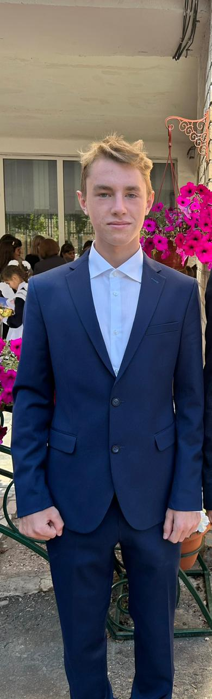

<!DOCTYPE html>
<html lang="ru">
<head>
	<meta charset="utf-8">
	<meta name="viewport" content="width-device-width, nitial-scale-1.0">
	<link rel="stylesheet" href="css/styles9.css">
	<title>Первый сайт Кирпичникова Алексея Евгеньевича </title>
</head>
<body>
	<header>
		

			<h2>Сайт Кирпичникова Алексея Евгеньевича </h2>
		

		<nav>
			<ul>
		<li><a href="#home">Главная</a></li>
		<li><a href="#obomne">Обо мне</a></li>
		<li><a href="#proekt">Мои проекты</a></li>
		<li><a href="#kontakt">Контакты</a></li>
			</ul>
		</nav>
	</header>
	<main>
	

		<h2 style="color: red;" >Добро пожаловать на мою страницу</h2>
		
Здесь я вам расскажу о себе и своей жизни 

	

	

		
     	

     		 Меня Зовут <H4> Алексей </H4>
	

	

			<h2 style="color: green">Мои проекты</h2>
			
Здесь собраны мой проекты, котрые я создал за время обучения на первом модуле проекта "Легкий вход в IT – Веб-разработка и Java".

			<ul>
				<li><a href="ssylka1.html">Блог о путешествии</a></li>
			<li><a href="ssylka2.html">Он-лайн календарь</a></li>
			<li><a href="ssylka3.html">Калькулятор</a></li>
			</ul>
	

	

         <h2 style="color: green">Контакты</h2>
        
Адрес: 4311261, г. Краснослободск, 3-й микрорайон, д. 10

        
Телефон: +79879997069

        
Email: alekirpichnikov63@gmail.com 

            

     </main>
	<footer>
		&copy; 2023 Сайт Кирпичникова Алексей Евгеньевича
	</footer>
</body>
</html>
